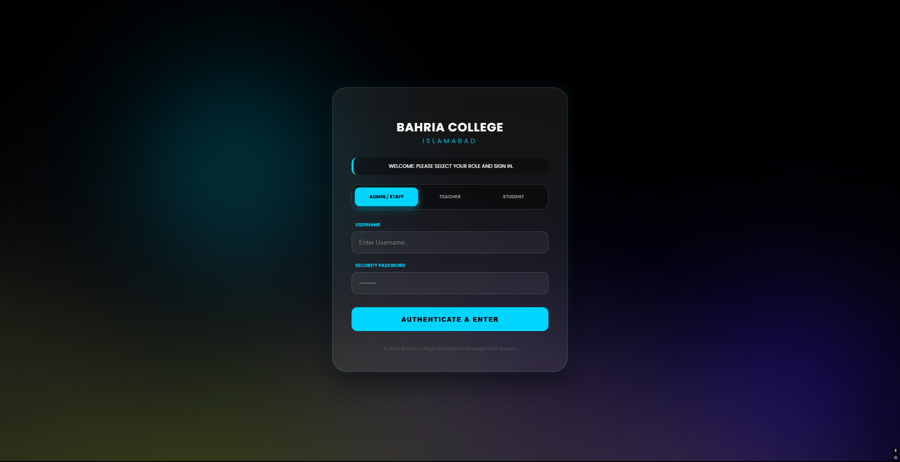
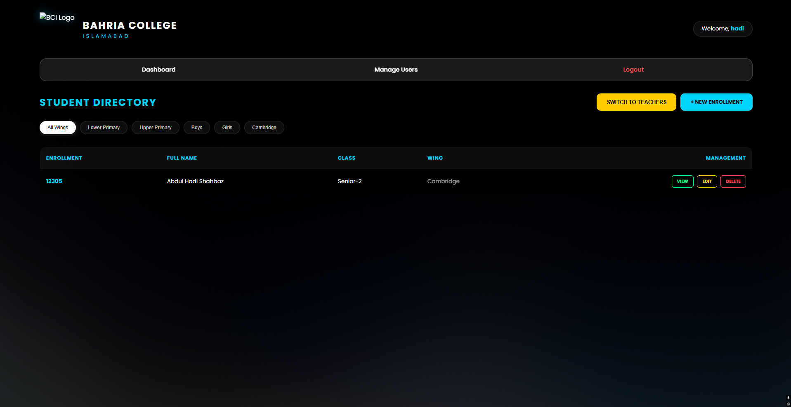
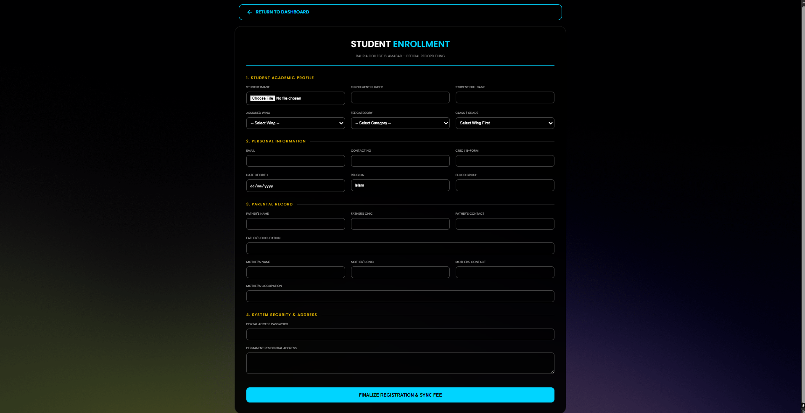
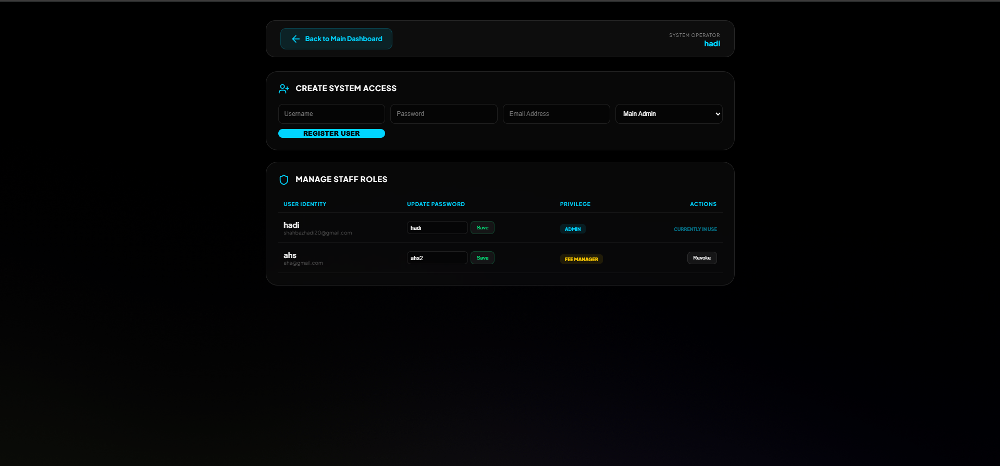

# 🎓 School Management System

A complete School Management System developed using **PHP, MySQL, HTML, CSS, and JavaScript**. The application provides an efficient way to manage student records, user accounts, and administrative tasks through a secure and user-friendly web interface.

---

## 🚀 Features

- 🔐 Secure Login & Authentication
- 📊 Admin Dashboard
- 👨‍🎓 Add Student Records
- ✏️ Edit Student Information
- ❌ Delete Student Records
- 👥 User Management
- 🔒 Change Password
- 📄 MySQL Database Integration
- 📑 Pagination for Student Records
- 📱 Responsive User Interface

---

## 🛠 Technologies Used

- PHP
- MySQL
- HTML5
- CSS3
- JavaScript
- XAMPP (Apache + MySQL)

---

## 📂 Project Structure

```
student-management-system
│
├── assets/
├── database/
├── index.php
├── dashboard.php
├── add_student.php
├── edit_student.php
├── delete_student.php
├── manage_users.php
├── change_password.php
└── logout.php
```

---

## 📸 Screenshots

### Login



### Dashboard



### Add Student



### Manage Users



## ⚙️ Installation

1. Clone the repository

```bash
git clone https://github.com/HadiShahbaz-36/School-Management-System.git
```

2. Move the project into the `htdocs` folder.

3. Import the SQL file located inside the `database` folder.

4. Start Apache and MySQL using XAMPP.

5. Open:

```
http://localhost/student-management-system
```

---

## 📌 Future Improvements

- Teacher Management
- Attendance Reports
- Fee Management
- Timetable Generator
- Parent Portal
- Email Notifications
- PDF Report Generation

---

## 👨‍💻 Developer

**Hadi Shahbaz**

Python Developer | Backend Developer | Web Developer

GitHub:
https://github.com/HadiShahbaz-36

---

## ⭐ Support

If you found this project useful, consider giving it a ⭐ on GitHub.
